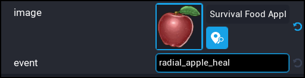

# Events

The `UI Radial Menu` component has a simple event system using [broadcasts](https://docs.coregames.com/core_api/#events).

## General Events

The `UI Radial Menu` component has some general events that you can trigger and connect too.  Below is a list of them and what they are used for.

| Event Name | Return Type | Description |
| ---------- | ----------- | ----------- |
| `radial_menu_opened` | None | Fires when the radial menu is opened. |
| `radial_menu_closed` | None | Fires when the radial menu is closed. |
| `close_radial_menu` | None | Broadcast to this event to close the radial menu. |
| `open_radial_menu` | None | Broadcast to this event to open the radial menu. |
| `disable_radial_menu` | None | Broadcast to this event to disable the radial menu. |
| `enable_radial_menu` | None | Broadcast to this event to enable the radial menu. |

## Menu Item Events

To be able to perform an action when a player clicks on a menu item, you need to make sure to set up a unique event name for each menu item.

| Event Name | Return Type | Description |
| ---------- | ----------- | ----------- |
| `YOUR_EVENT` | Event&lt;UI_Radial_Menu_Item, UIButton, UIImage, Tween&gt; | Fires your event when the player clicks an item in the radial menu. `YOUR_EVENT` is the name of the event you set when setting up your menu items. Note: `Tween` can be `nil` if it has finished. |

As an example, let's say we have an apple that is a consumable in the radial menu, when clicked the player is healed.



```lua
Events.Connect("radial_apple_heal", function()

	-- Your code here to handle healing the player
	
	print("Healing the player.")

end)
```