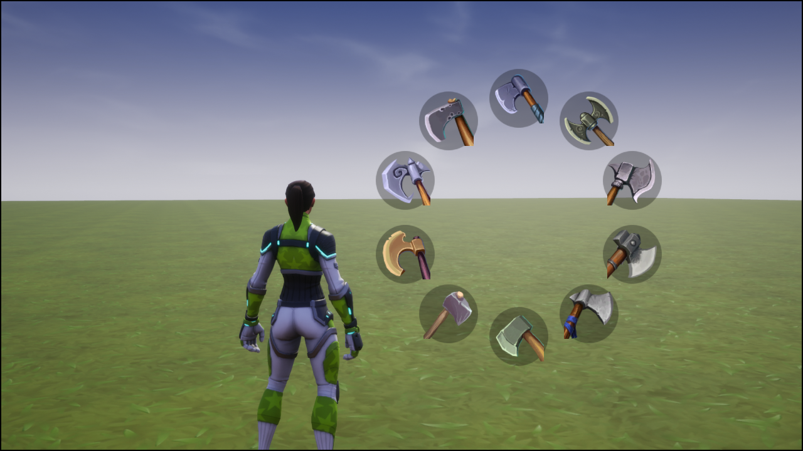

# UI Radial Menu Documentation

Welcome to the documentation for the `UI Radial Menu` component found in [Core](https://coregames.com) Community Content.

This component will allow you to setup a radial menu that players can open and click on an item.  It is easy to setup and has various events to hook into.

If you want to get up and running quickly, then read the [Quick Start](quick-start) guide, otherwise I would recommend reading through the pages and then try out the example that comes with the content.

