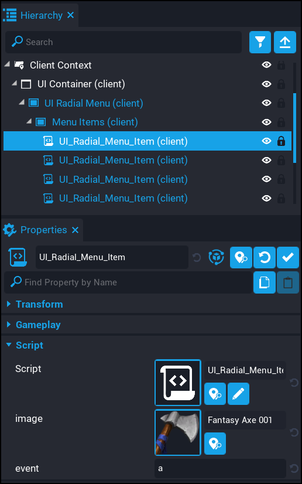

# Menu Items

Creating menu items is really simple.  

1. Deinstance the `UI Radial Menu` component in your hierarchy.
2. Expand the `Menu Items` folder inside the `UI Radial Menu` component.
3. Create / edit menu items.

| Property Name | Description |
| ------------- | ----------- |
| `image` &nbsp; &nbsp; &nbsp; &nbsp; &nbsp; &nbsp; &nbsp; &nbsp; &nbsp; &nbsp; | The image that will be used for this menu item. |
| `event` | The event name for this menu item.  This is a broadcast event that is fired when the menu item is clicked on by the player.  This needs to be unique. |