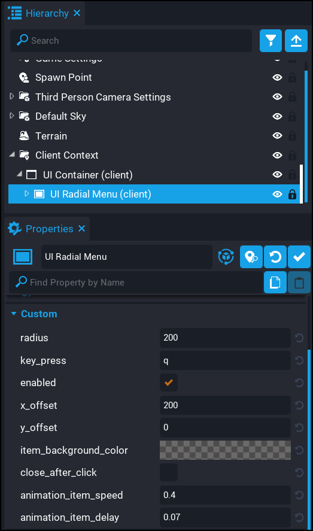

# Properties

The `UI Radial Menu` component comes with a few properties that allow for easy customisation.

| Property Name | Description |
| ------------- | ----------- |
| `radius` | The radius of the radial menu. |
| `key_press` | The key that players will press to open and close the radial menu. |
| `enabled` | If true (default) then the radial menu can be opened. |
| `x_offset` | The X offset (left to right) of the radial menu.  Useful if you need to move it away from the player in third person view. |
| `y_offset` | The Y offset (up to down) of the radial menu. |
| `item_background_color` | The background color of each item in the radial menu. |
| `close_after_click` | If enabled, then when players click on an item in the radial menu the menu will automatically close. |
| `animation_item_speed` | The speed of the menu item in reaching its position. |
| `animation_item_delay` | The delay of the menu item before it starts the path to its position. |